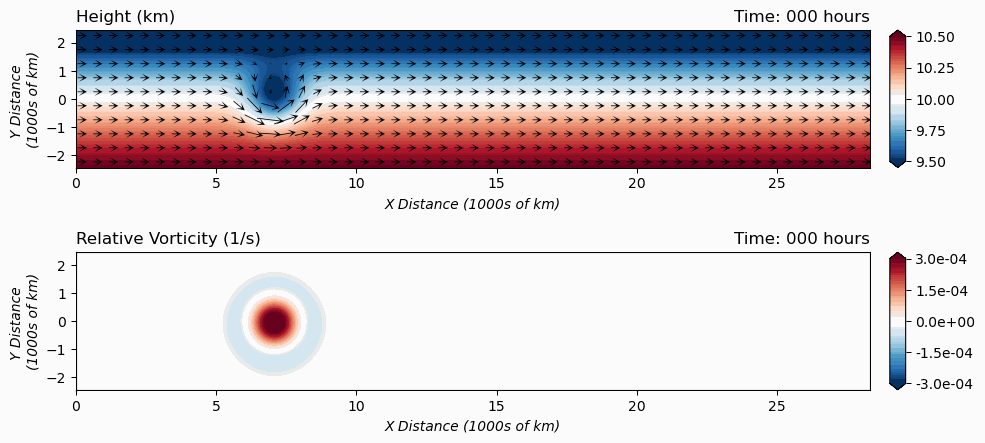

# python_notebooks

This is a repository of python notebooks (and associated data) that may be of general interest:

<b> QG_PV_inversion.ipynb </b>

This python notebook is a quick translation from Greg Hakim's Matlab code for QG PV inversion.  

  

<b> Shallow Water Model folder </b>

This folder contains notebooks and data for a shallow water model and some idealized experiments.

  
<b> Intro_to_PCA_and_Clustering_Part_1.ipynb </b>

This python notebook is intended to provide a basic introduction to Principal Component Analysis (PCA) and k-means clustering through application of the techniques to the joint variability of two standard El Nino - Southern Oscillation (ENSO) indices, Nino3.4 and the SOI. Principal Components are also referred to as Empirical Orthogonal Functiions (EOFs), so the analysis is also relevant to EOFs, although the terminology varies slightly. This example is too simple to give a good sense of the power of these methods or some of the important subtleties in their use, but is simple enough to more clearly show some of their basic aspects. The data for the indices needs to be available in two text files (provided here), nino34.txt and soi.txt, in the same directory as the notebook. Support from NOAA MAPP NA20OAR4310424 is gratefully acknowledged.

