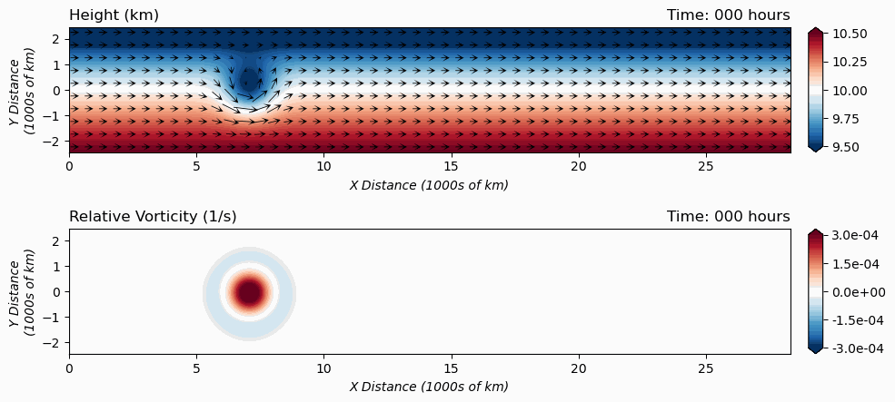
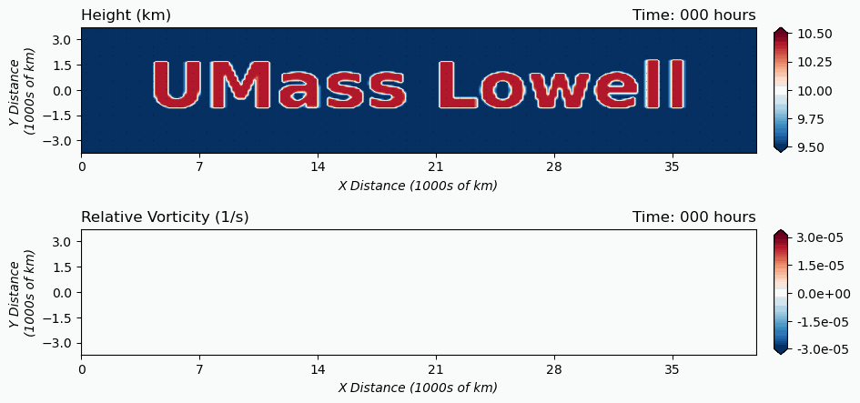

This folder contains a Jupyter python notebook to run a shallow water model with several pre-defined experiments, as well as some supplemental files. The notebook is currently in beta form and may cause nausea, itching, and intermittent weeping.

The python notebook, **shallow_water_model.ipynb**, solves the non-linear shallow water equations on a Cartesian beta plane in a channel, with several different options for the setup of the model to illustrate a range of meteorological phenomena. All animations have been commented out, as the file is too large to upload otherwise.

The code and experiment set was originally programed in MATLAB by Robin Hogan and translated to python by Paul Connolly. It was hacked roughly into notebook form by Matt Barlow, with a few additional features added, ignoring all principles of robust coding. If you have any questions, find any bugs, or develop any improvements please email Mathew_Barlow@uml.edu.  

A separate pdf file, swe_notes.pdf, further describes the different intial conditions and configurations, and two additional data files, digitial_elevation_map.mat and reanalysis.mat, are also included, which are needed for some (but not most) of the experiments.

The experiments include an idealized cyclone in westerly flow, barotropic instability, gravity waves, tsunamis, orography, equatorial waves, and others. A second version of the model that runs from user-specified initial conditons is also included. Functions for plotting and making animations of the model output are included. Note that the in-line animations can be slow to render (3 to 4 minutes each on my laptop).

Two versions of the notebook are provided: one with all the cells run, except for animations; and one 'clear' version with all the code cells cleared. 

Support from NSF AGS-1623912, NSF AGS-1657921, and NOAA MAPP NA20OAR4310424 is gratefully acknowledged.

The results from some of the experiments are shown below. 

**Cyclone in Westerly**

**Barotropic Instability**

**Realistic Orography**

**Gravity Wave Swag**

